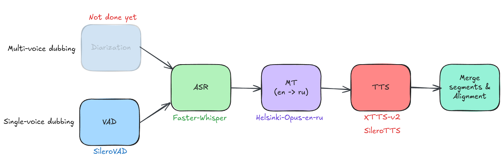

# Video Dubbing


## To do
- [ ] Logging ✍️
- [ ] Reading and processing configs 📚
- [ ] Batch processing ⬆️
- [ ] Diarization for multi-speaker dubbing
- [ ] OpenAI API for high quality translation 
- [ ] OpenAI API for processing transcription before translation (numbers -> words)

## Project structure
```
root/
├── app/  # streamlit demo app      
└── notebooks/       
└── scripts/  # scripts for datasets processing
└── video_dubbing/
	└── core/  # basic classes
	└── pipelines/  # implementation of all stages of dubbing
	└── utils/  # extra useful thing, configs for example
	└── video_dubber.py  # API for video dubbing
```

## Dev mode instruction
1. Clone repository
```bash
git clone https://github.com/Maksim-Goncharovskiy/video-dubbing.git
```

2. Make virtual enviroment for Python 3.10.18. You can use Miniconda:
```bash
conda create -n project_env_name python=3.10
```

3. Go to repository dir and install requirements:
```bash
pip install -r requirements.txt
```

4. Install video dubbing module
```bash
pip install -e .
```

## Fine-tuning XTTS-v2
### Dataset
For fine-tuning I used the RUSLAN dataset. It was preprocessed by script: `/scripts/process_ruslan_dataset.py`

You can download preprocessed version from kaggle: https://www.kaggle.com/datasets/maksimgoncharovskiy/ruslan-preprocessed

### Fine-tuned model
You can download and use my checkpoint from kaggle: https://www.kaggle.com/models/maksimgoncharovskiy/xtts-v2_ruslan_134566
